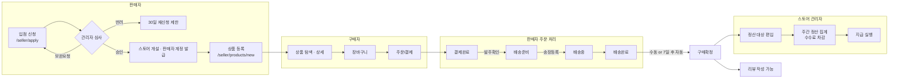

# 곳간 GOTGAN — 멀티 스토어 오픈마켓 목업

> 작은 가게들의 큰 장터.
> 판매자가 **입점 신청 → 관리자 승인 → 자기 스토어 운영**을 하고, 구매자는 여러 스토어의 상품을 한 번에 구매하며, 운영자는 스토어별 판매대금을 **수수료를 제외하고 정산**하는 스마트스토어형 E-커머스의 **화면 목업**입니다.

- 실제 API / DB 연동 없음 → **모든 데이터는 `src/data/*.js` 에 하드코딩**
- 화면 이동, 상태 변화(장바구니 담기, 발주확인, 입점 승인 등)는 **프론트 상태로만 흉내** (새로고침 시 초기화)
- 화면 좌측 하단 **`MOCK 화면 목록`** 버튼으로 43개 화면 어디로든 바로 이동 가능

---

## 1. 실행 방법

```bash
npm install
npm run dev        # http://localhost:5173
```

| 스크립트 | 설명 |
| --- | --- |
| `npm run dev` | 개발 서버 (Vite, Node.js 18+) |
| `npm run build` / `npm run preview` | 프로덕션 빌드 / 빌드 결과 미리보기 |
| `npm run fetch:images` | 목업 이미지 재수집 (이미 있는 파일은 건너뜀) |

### 사용자별 진입 경로

| 역할 | 시작 URL | 목업 계정 |
| --- | --- | --- |
| 구매자 | `/` | 김서연 (골드 회원) |
| 판매자 | `/seller` | 오롯이 리넨 · 한지우 대표 |
| 스토어 관리자 | `/admin` | 곳간 운영팀 |

로그인 화면(`/login`)에서 구매회원 / 판매자 / 운영자 탭을 고르고 로그인 버튼을 누르면 각 영역으로 이동합니다. (인증 없음)

---

## 2. 기술 스택

| 구분 | 사용 | 비고 |
| --- | --- | --- |
| UI | React 18 | 함수형 컴포넌트 + hooks |
| 라우팅 | react-router-dom 6 | 중첩 라우트 + 레이아웃(Outlet) |
| 스타일 | Tailwind CSS 4 (`@tailwindcss/vite`) | 디자인 토큰은 `src/index.css` 의 `@theme` |
| 빌드/개발서버 | Vite 6 (Node.js) | |
| 아이콘 | lucide-react | 선 굵기 1.6~1.8 로 통일 |
| 폰트 | Pretendard (본문), IBM Plex Mono (숫자·주문번호) | CDN |
| 차트 | 직접 그린 SVG (`BarChart`, `HBars`, `Spark`) | 차트 라이브러리 미사용 |

---

## 3. 폴더 구조

```
expage/
├─ public/images/          # 목업 이미지 (Unsplash, 141장) + CREDITS.txt
│  ├─ p/                   #   상품 이미지  p{상품ID}-{1..3}.jpg
│  ├─ banner/ store/ avatar/
├─ scripts/fetch-images.mjs  # 이미지 수집 스크립트
├─ src/
│  ├─ data/                # ★ 하드코딩 목업 데이터
│  │  ├─ catalog.js        #   카테고리(수수료율) · 스토어 9 · 상품 38
│  │  ├─ people.js         #   회원 14 · 배송지 · 쿠폰 · 입점신청 5
│  │  ├─ reviews.js        #   리뷰(시드 랜덤 생성) · 신고 리뷰 · Q&A
│  │  └─ orders.js         #   주문상태 정의 · 내 주문 · 판매자 주문 · 정산 · 일별 매출
│  ├─ lib/
│  │  ├─ format.js         #   금액/날짜 포맷, 시드 난수, 기준일(2026-10-01)
│  │  └─ store.jsx         #   전역 상태: 장바구니 · 찜 · 토스트
│  ├─ components/
│  │  ├─ ui.jsx            #   Stars, Pill/StatusPill, Price, Modal, Kpi, BarChart, Segments, KV …
│  │  ├─ ProductCard.jsx
│  │  └─ MockNav.jsx       #   목업 화면 바로가기 패널
│  ├─ layouts/
│  │  ├─ ShopLayout.jsx    #   쇼핑몰 헤더/메가메뉴/푸터
│  │  └─ ConsoleLayout.jsx #   판매자센터·관리자 공용 콘솔 (상단바 + 사이드메뉴 + 알림)
│  ├─ pages/
│  │  ├─ shop/             #   메인, 목록, 상세, 스토어, 장바구니, 결제, 로그인, 입점신청
│  │  ├─ mypage/           #   주문/배송, 클레임, 리뷰, 찜, 쿠폰, 회원정보, 배송지
│  │  ├─ seller/           #   대시보드, 상품 CRUD, 주문, 클레임, 리뷰, 문의, 정산, 스토어설정
│  │  └─ admin/            #   대시보드, 입점심사, 스토어, 정산, 회원, 신고리뷰, 카테고리
│  └─ App.jsx              # 전체 라우트 정의
└─ README.md
```

---

## 4. 전체 비즈니스 플로우



### 4-1. 주문 상태 (상품주문 단위)

한 번의 결제에 여러 스토어 상품이 섞일 수 있으므로, **주문번호(결제 단위)** 아래에 **상품주문번호(스토어·상품 단위)** 를 두고 **상태는 상품주문 단위로 관리**합니다. (스마트스토어 방식)

| 상태 | 누가 바꾸나 | 다음 상태 | 구매자 가능 액션 |
| --- | --- | --- | --- |
| 결제완료 | 시스템 | 배송준비 (판매자 **발주확인**) | 즉시 취소 |
| 배송준비 | 판매자 | 배송중 (판매자 **송장등록**) | 취소 요청 (판매자 승인 필요) |
| 배송중 | 택배사 연동 | 배송완료 | 배송조회 |
| 배송완료 | 택배사 연동 | 구매확정 | 구매확정 / 반품 요청 / 교환 요청 |
| 구매확정 | 구매자 or **7일 후 자동** | — | 리뷰 작성 (30일 이내) |
| 취소요청 / 반품요청 / 교환요청 | 구매자 | 취소완료 / 반품완료 / (재발송) 배송중 | 요청 철회 |

- 판매자가 클레임을 **3영업일 내 미처리** 시 운영자가 직권 처리 + 판매자 페널티 점수 부과
- 판매자가 클레임을 **거부**하면 구매자는 분쟁 조정 신청 가능

### 4-2. 정산 규칙 (핵심)

```
지급액 = 구매확정 매출 − 환불 − 판매수수료(카테고리별) − 결제수수료(2.2%)
```

| 항목 | 규칙 |
| --- | --- |
| 정산 기준일 | **구매확정일** (배송완료가 아니라 확정 시점 → 반품 리스크 제거) |
| 정산 주기 | 주 1회 · 월~일 구매확정분 → **다음 주 목요일 지급** |
| 판매수수료 | 카테고리별 (아래 표) · 스토어별 개별 조정 가능 · 신규 입점 3개월 50% 지원 |
| 결제수수료 | PG 수수료 2.2% 일괄 |
| 지급 보류 | 클레임 미처리, 스토어 휴면/정지 시 해당 주차 보류 → 해소 후 지급 |
| 수수료 변경 | 판매자 공지 후 7일 뒤 적용 (관리자 > 카테고리·수수료에서 "변경 예약") |

| 카테고리 | 판매수수료 | 합계(결제수수료 포함) | 추가 입점 서류 |
| --- | --- | --- | --- |
| 패션의류 | 11% | 13.2% | — |
| 신발·가방 | 11% | 13.2% | — |
| 리빙·인테리어 | 9% | 11.2% | — |
| 식품 | 7% | 9.2% | 영업신고증 / 농업경영체 |
| 뷰티 | 10% | 12.2% | 화장품 책임판매업 등록필증 |
| 디지털·가전 | 6% | 8.2% | KC 인증서 |

### 4-3. 입점 심사

`심사대기 → (보완요청) → 승인 / 반려`

- 제출 서류: 사업자등록증, 통신판매업 신고증, 정산계좌 통장사본, 대표 상품 사진 (+ 카테고리별 인증서)
- 관리자 체크리스트(국세청 사업자 상태, 통판 신고, 중복 입점, 카테고리 적합성, 인증서)를 **모두 체크해야 승인 버튼 활성화**
- 승인 시: 스토어 생성(운영중) → 판매자센터 계정 발급 → 안내 메일/알림톡 → 메인 신규 스토어 2주 노출
- 보완요청 후 7일 내 미보완 시 자동 반려 / 반려 후 30일 재신청 제한

### 4-4. 스토어 상태

| 상태 | 쇼핑몰 노출 | 주문 처리 | 정산 |
| --- | --- | --- | --- |
| 운영중 | O | O | 정상 |
| 휴면 (판매자 신청) | X (스토어·상품 숨김) | 진행 중 주문만 | 클레임 해소 후 지급 |
| 정지 (관리자 제재) | X | 제한 | 지급보류 |

> 목업 데이터에서 **볕드는집(s5)** 이 휴면 상태 예시입니다. 쇼핑몰에서 상품이 사라지고, `/store/s5` 접근 시 휴면 안내가, 관리자 정산에서는 지급보류가 표시됩니다.

### 4-5. 리뷰 · 평점

- 작성 조건: **구매확정된 상품주문 1건당 1개**, 확정 후 30일 이내
- 적립: 텍스트 100P / 포토 500P
- 패션·신발 카테고리는 **사이즈 체감(작아요/정사이즈/커요)** 수집 → 상세에서 분포 표시
- 판매자는 **답글만 가능, 삭제 불가** → 부당 리뷰는 '신고'로 관리자 검토 요청
- 신고 3회 이상 누적 시 **자동 블라인드** → 관리자 최종 판단 (블라인드 유지 / 정상 노출 / 작성자 제재)

### 4-6. 배송비

- **스토어 단위 묶음배송**: 같은 스토어 상품끼리 배송비 1회, 스토어별 무료배송 기준 적용
- 장바구니에서 스토어별로 그룹핑하고 "○○원 더 담으면 무료배송" 안내

### 4-7. 회원 등급

최근 6개월 구매확정 금액 기준, 매월 1일 갱신 — 일반 / 실버(30만) / 골드(80만) / VIP(200만). 1년 미접속 시 휴면(개인정보 분리보관).

---

## 5. 요구사항 외에 추가한 기능

| 영역 | 추가 내용 | 이유 |
| --- | --- | --- |
| 공통 | **구매확정 단계 + 자동 확정(7일)** | 정산 시점을 명확히 하기 위한 오픈마켓 표준 |
| 공통 | 취소/반품/교환 클레임 플로우 (구매자 신청 → 판매자 승인/거부) | 실제 운영에서 가장 많은 CS |
| 공통 | 상품 Q&A (비밀글 포함) | 판매자 응대 지표 |
| 구매자 | 스토어별 묶음배송 · 무료배송 임계값 안내 | 멀티 스토어 장바구니의 핵심 UX |
| 구매자 | 쿠폰 · 포인트 · 회원 등급 | 결제 화면 할인 영역 구성 |
| 구매자 | 스토어 홈 + 알림받기(관심고객) | 스마트스토어 '내 스토어' 개념 |
| 구매자 | 품절 상품 재입고 알림 | 품절 상태 화면 |
| 판매자 | 조합형 옵션 + 조합별 재고 테이블, **예상 정산액 계산기** | 상품 등록 시 수수료 인지 |
| 판매자 | 송장 일괄입력 모달, 발송지연 안내 | 주문 대량 처리 |
| 판매자 | 자주 쓰는 답글, 리뷰 신고 | 리뷰 관리 효율 |
| 판매자 | 휴면 신청 | 스토어 상태 관리 |
| 관리자 | 입점 심사 **체크리스트 / 보완요청 / 반려 사유** | 심사 프로세스 표준화 |
| 관리자 | 카테고리별 수수료 관리 · 스토어별 개별 수수료 | 수수료 정책 |
| 관리자 | 정산 지급 실행 / **지급보류(사유)** | 정산 리스크 관리 |
| 관리자 | 신고 리뷰 검토, 회원 이용정지 · 포인트 지급 | 콘텐츠·회원 관리 |
| 관리자 | 상품 강제 판매중지, 스토어 페널티 점수 | 판매자 제재 |

---

## 6. 화면 목록 (43개 라우트)

### 구매자 · 쇼핑몰
| 화면 | 경로 | 주요 요소 |
| --- | --- | --- |
| 메인 | `/` | 배너 캐러셀, 카테고리, 카테고리별 랭킹, 이번 주의 가게, 신상, 포토리뷰, 입점 CTA |
| 상품 목록 | `/products?cat=&sub=&q=&sort=&tag=` | 카테고리/가격/혜택 필터, 6종 정렬, 모바일 필터 드로어 |
| 상품 상세 | `/products/:id` | 갤러리, 연동 옵션 선택, 배송정보, 별점 분포, **사이즈 체감**, 포토리뷰, 리뷰 필터/정렬/도움돼요, Q&A, 배송·교환·반품, 스토어 카드 |
| 스토어 목록 / 홈 | `/stores`, `/store/:id` | 스토어 소개, 알림받기, 스토어 내 카테고리 탭 |
| 장바구니 | `/cart` | 스토어별 그룹, 수량, 선택삭제, 무료배송까지 남은 금액 |
| 주문/결제 | `/checkout` | 배송지 선택, 쿠폰/포인트, 결제수단, 약관 동의 |
| 주문 완료 | `/order/complete` | |
| 로그인 / 회원가입 / FAQ | `/login`, `/signup`, `/help` | 역할별 로그인 탭, 간편로그인 |
| 입점 신청 | `/seller/apply` | 4단계 폼 (판매자 정보 → 스토어·상품 → 서류 → 정산·약관) → 접수 타임라인 |

### 구매자 · 마이페이지
| 화면 | 경로 |
| --- | --- |
| 주문 · 배송 (상태별 카운트, 상태별 액션 버튼) | `/mypage/orders` |
| 주문 상세 (배송 추적 타임라인, 결제정보) | `/mypage/orders/:id` |
| 취소/반품/교환 신청 (사유별 배송비 부담 · 환불 예정액 계산) | `/mypage/claim/:lineId?type=반품` |
| 클레임 내역 | `/mypage/claims` |
| 리뷰 관리 (작성 가능 / 작성한 리뷰, 별점·사이즈·사진 작성 모달) | `/mypage/reviews` |
| 찜 · 쿠폰/포인트 · 회원정보 · 배송지 | `/mypage/wishlist`, `/coupons`, `/profile`, `/addresses` |

### 판매자센터 (`/seller`)
| 화면 | 경로 |
| --- | --- |
| 대시보드 (할 일, KPI, 30일 매출 차트, 인기상품, 재고부족, 새 리뷰, 공지) | `/seller` |
| 상품 조회 (상태 필터, 일괄 판매중지/재개/삭제) | `/seller/products` |
| 상품 등록 / 수정 | `/seller/products/new`, `/seller/products/:id/edit` |
| 주문 관리 (기간·검색, 상태 탭, 발주확인, 송장 일괄 입력) | `/seller/orders` |
| 주문 상세 (배송지, 처리 이력, 건별 정산 예정액) | `/seller/orders/:lineId` |
| 취소/반품/교환 (승인/거부, 처리기한 임박 표시) | `/seller/claims` |
| 리뷰 관리 (평점 분포, 상품별 평점, 답글, 신고) | `/seller/reviews` |
| 상품 문의 | `/seller/qna` |
| 정산 내역 (주차별, 상세 모달) | `/seller/settlements` |
| 스토어 설정 (기본정보, 배송정책, 사업자/정산정보, 휴면 신청) | `/seller/store` |

### 스토어 관리자 (`/admin`)
| 화면 | 경로 |
| --- | --- |
| 운영 대시보드 (할 일, GMV, 수수료 수익, 카테고리별 거래액, 스토어 순위) | `/admin` |
| 입점 심사 목록 / 상세 (체크리스트, 승인·보완요청·반려 모달) | `/admin/applications`, `/admin/applications/:id` |
| 스토어 관리 / 상세 (상태 변경, 개별 수수료, 강제 판매중지, 정산 이력) | `/admin/stores`, `/admin/stores/:id` |
| 정산 관리 (주차 선택, 합계, 지급 실행, 지급보류 사유) | `/admin/settlements` |
| 회원 관리 / 상세 (이용정지, 포인트 지급/회수) | `/admin/users`, `/admin/users/:id` |
| 신고 리뷰 | `/admin/reviews` |
| 카테고리 · 수수료 | `/admin/categories` |

---

## 7. 디자인 가이드

**"AI가 만든 템플릿 느낌"을 피하기 위해 지킨 원칙**

- ❌ 보라/파랑 그라데이션, 글래스모피즘, 둥근 카드 + 그림자 남발, 이모지 아이콘, 원형 아이콘 카테고리
- ✅ **각진 모서리(라운드 0)**, 1px 얇은 선, 그림자는 드롭다운/모달에만
- ✅ 색은 **먹색(#141414) + 따뜻한 회색 + 포인트 주홍(#ff5a1f) 하나**. 상태 색(moss/amber/rust/sky)은 상태 뱃지에만
- ✅ 숫자(가격·주문번호·수량)는 **모노스페이스(IBM Plex Mono) + tabular-nums** 로 표·대시보드 가독성 확보
- ✅ 쇼핑몰은 29CM · 무신사 같은 **에디토리얼 톤** (큰 타이포, 영문 eyebrow 라벨, 흑백 섹션 대비)
- ✅ 콘솔은 네이버 스마트스토어센터 · Shopify Admin 같은 **회색 작업면 + 흰 패널 + 촘촘한 표**
- ✅ 차트는 라이브러리 없이 SVG로 직접: 단일 계열, 4px 둥근 막대 끝, 마지막 날(오늘)만 포인트 컬러, hover 툴팁
- ✅ 한국어 줄바꿈 `word-break: keep-all`, 모바일 375px 에서 가로 스크롤 없음

### 참고한 레퍼런스

| 대상 | 참고 포인트 |
| --- | --- |
| 네이버 스마트스토어 / 스마트스토어센터 | 상품주문 단위 상태 관리, 판매자센터 메뉴 구성(상품·주문배송·정산·고객), 스토어 홈 |
| 쿠팡 · 11번가 · G마켓 | 카테고리별 수수료 구조, 구매확정 기준 정산, 정산 주기 |
| 29CM · 무신사 | 에디토리얼 메인, 상품 카드 정보 밀도, 리뷰 사이즈 체감 |
| Shopify Admin | 콘솔 레이아웃, 표 + 일괄 액션 바 |
| Baymard / NN/g 상품상세 UX 가이드 | 별점·리뷰수 위치(상품명~가격 사이), 별점 분포 클릭 필터 |

### 디자인 토큰 (`src/index.css`)

| 토큰 | 값 | 용도 |
| --- | --- | --- |
| `ink` | `#141414` | 텍스트, 주요 버튼, 상단바 |
| `cream` / `sand` | `#f6f4ef` / `#ece8df` | 보조 배경, 표 헤더 |
| `work` | `#f1f1ef` | 콘솔 작업면 |
| `point` | `#ff5a1f` | 할인율, 알림 뱃지, 결제 CTA, 오늘 막대 |
| `moss` / `amber` / `rust` / `sky` | — | 상태 뱃지 (정상/대기/위험/진행) |

공통 클래스: `.btn .btn-ink .btn-line .btn-point`, `.field`, `.panel .panel-head`, `.tbl`, `.tab .tab-on`, `.num`, `.eyebrow`

---

## 8. 목업 데이터

| 데이터 | 개수 | 위치 |
| --- | --- | --- |
| 카테고리 | 6 (세부 분류 포함) | `data/catalog.js` |
| 스토어 | 9 (운영중 8, 휴면 1) | `data/catalog.js` |
| 상품 | 38 (판매중 · 품절 · 판매중지 포함) | `data/catalog.js` |
| 회원 | 14 (정상 · 휴면 · 이용정지) | `data/people.js` |
| 입점 신청 | 5 (심사대기 2 · 보완요청 · 승인 · 반려) | `data/people.js` |
| 리뷰 | 약 300 (시드 고정 랜덤 생성, 신고 4건 포함) | `data/reviews.js` |
| 내 주문 / 판매자 주문 | 7건 / 42건 (모든 상태 포함) | `data/orders.js` |
| 정산 | 9 스토어 × 8주 | `data/orders.js` |

- 기준일은 **2026-10-01(목)** 로 고정 (`lib/format.js` 의 `TODAY`)
- 랜덤 데이터는 시드 난수(`seeded()`)로 생성 → 새로고침해도 동일
- 이미지: Unsplash (Unsplash License, 무료 상업 이용 가능). 출처는 `public/images/CREDITS.txt`. **실서비스 전환 시 실제 상품 사진으로 교체**

---

## 9. 실제 개발로 넘어갈 때 (제안)

### 주요 엔티티

```
User(회원) ─┬─< Order(주문=결제단위) ─< OrderItem(상품주문: 상태·송장·클레임)
            ├─< Review (OrderItem 1:1)
            └─< CartItem / Wish / Address / Coupon / PointHistory

Seller(판매자 계정) ─ Store(스토어: 상태·등급·수수료) ─< Product ─< ProductOption(조합·재고)
StoreApplication(입점신청: 서류·심사상태·사유)
Category(수수료율) ─< Product
Settlement(스토어×주차) ─< SettlementItem(구매확정 OrderItem)
ReviewReport(신고) / Penalty(판매자 페널티)
```

### API 예시 (역할별 prefix)

| 역할 | 예시 |
| --- | --- |
| 구매자 | `GET /api/products?cat=&sort=`, `GET /api/products/:id/reviews`, `POST /api/cart`, `POST /api/orders`, `POST /api/order-items/:id/confirm`, `POST /api/order-items/:id/claims` |
| 판매자 | `POST /api/seller/products`, `PATCH /api/seller/order-items/confirm`(발주확인 일괄), `PATCH /api/seller/order-items/ship`(송장), `POST /api/seller/reviews/:id/reply`, `GET /api/seller/settlements` |
| 관리자 | `PATCH /api/admin/applications/:id`(approve/supplement/reject), `PATCH /api/admin/stores/:id/status`, `POST /api/admin/settlements/pay`, `PATCH /api/admin/reviews/:id/blind` |

### 배치(스케줄러) 필요 작업

1. 배송완료 + 7일 → **자동 구매확정**
2. 매주 월요일 → 지난주 구매확정분 **정산 집계**, 목요일 → 지급
3. 클레임 3영업일 미처리 → 직권 처리 + 페널티
4. 보완요청 7일 경과 → 자동 반려
5. 매월 1일 → 회원 등급 · 판매자 등급 갱신 / 1년 미접속 → 휴면

### 역할 분담 예시

| 파트 | 범위 |
| --- | --- |
| FE-쇼핑몰 | `pages/shop`, `pages/mypage` |
| FE-콘솔 | `pages/seller`, `pages/admin`, `ConsoleLayout` |
| BE-주문/결제 | Order, OrderItem 상태머신, PG 연동, 클레임 |
| BE-정산/관리 | 입점 심사, 스토어, 정산 배치, 수수료 |
